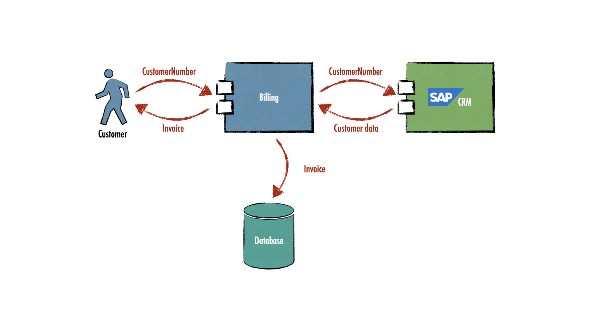
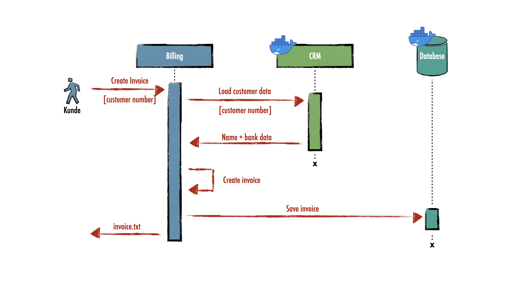

# Testcontainers example

A demo during a _Freitagsfrühstück_ at [Neusta](https://www.team-neusta.de/) about [Testcontainers](https://www.testcontainers.org/).

## Use case

A _billing_ services to create and store invoices.

**Disclaimer:** SAP is used here as an example because it is known to provide large monoliths that have longer start times.

### Distribution view

### Runtime view

## Challenge

Write an application with integrated tests to the database and SAP. Additionally there should be a happy path system integration test.

## Solution

1. Write a SAP [crm-mock](crm-mock)  to guarantee fast startup times. Furthermore, this mock provides a defined test set for the corresponding integration tests.
2. Use [Testcontainers](https://www.testcontainers.org/) to start a suitable test environment.
3. See [Billing demo](billing) to get some help